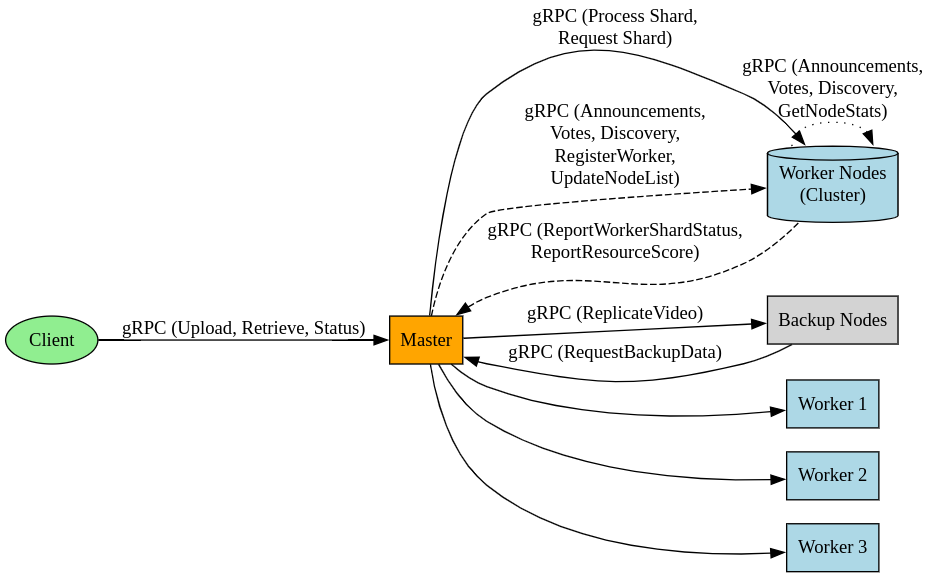

# Distributed Video Encoding System

This project implements a basic distributed system for uploading, processing (encoding/resizing), and retrieving video files using gRPC. The system consists of a master node that manages tasks and worker nodes that perform the actual video processing.

## Components

- **`replication.proto`**: Defines the gRPC services and message structures used for communication between the client, master node, and worker nodes.
- **`node.py`**: Implements the core logic for both the master and worker roles. A single instance of `node.py` can run as either a master or a worker.
  - **Master Role**: Handles client requests (upload, retrieve, status), segments large videos, distributes processing tasks to workers, collects processed shards, and concatenates them into the final output video. It also includes basic node discovery and election-related RPCs (though the full consensus logic might not be fully implemented).
  - **Worker Role**: Receives video shards from the master, processes them (e.g., resizing using FFmpeg), and provides the processed shards back to the master upon request.
- **`client.py`**: A command-line client application that interacts with the master node to upload videos for processing, check the status of processing tasks, and retrieve the final processed video. It includes a progress bar for video retrieval using `tqdm`.

## Features

- **Video Upload**: Clients can upload video files to the master node.
- **Distributed Processing**: The master distributes video processing tasks (on segmented video shards) to available worker nodes.
- **Video Retrieval**: Clients can retrieve the processed video from the master once the processing is complete.
- **Processing Status**: Clients can query the status of their video processing tasks.
- **Basic Node Roles**: Supports running nodes as either a master or a worker.
- **gRPC Streaming**: Uses gRPC for efficient streaming of video data during upload and retrieval.
- **Download Progress Bar**: The client shows a progress bar during video retrieval.

## Prerequisites

- Python 3.7+
- `pip` package installer
- FFmpeg installed and accessible in the system's PATH on both master and worker nodes (used for video segmentation, processing, and concatenation).
- `grpcio` and `protobuf` Python packages.
- `tqdm` Python package (for the client progress bar).
- `psutil` Python package (for node stats).
- `ffmpeg-python` Python package (a Python wrapper for FFmpeg).

## Setup

1.  **Install Dependencies**:

    Bash

    ```
    pip install grpcio protobuf grpcio-tools tqdm psutil ffmpeg-python

    ```

2.  **Install FFmpeg**: Ensure FFmpeg is installed on your system and available in the PATH. You can usually install it via your system's package manager (e.g., `sudo apt-get install ffmpeg` on Debian/Ubuntu, `brew install ffmpeg` on macOS).

3.  **Compile the `.proto` file**: Generate the Python gRPC code from the `replication.proto` file.

    Bash

    ```
    python -m grpc_tools.protoc -I. --python_out=. --grpc_python_out=. replication.proto

    ```

    This will generate `replication_pb2.py` and `replication_pb2_grpc.py` in the same directory.

## Running the System

You need to start one node as the master and one or more nodes as workers.

1.  **Start the Master Node**:

    Bash

    ```
    python node.py --host <master_host> --port <master_port> --role master

    ```

    Replace `<master_host>` and `<master_port>` with the IP address/hostname and port the master should listen on.

2.  **Start Worker Nodes**:

    Bash

    ```
    python node.py --host <worker_host> --port <worker_port> --role worker --master <master_host>:<master_port> --nodes <master_host>:<master_port>,<other_worker_host>:<other_worker_port>,...

    ```

    Replace `<worker_host>` and `<worker_port>` with the worker's address. Replace `<master_host>:<master_port>` with the address of the running master node. The `--nodes` argument should be a comma-separated list of known node addresses, including the master and other workers. This helps nodes discover each other.

    _Example (Master on localhost:50051, Worker on localhost:50052)_:

    - Start Master: `python node.py --host localhost --port 50051 --role master`
    - Start Worker: `python node.py --host localhost --port 50052 --role worker --master localhost:50051 --nodes localhost:50051,localhost:50052`

## Using the Client

The `client.py` script provides commands for interacting with the master node.

Bash

```
python client.py --master <master_host>:<master_port> [command] [options]

```

- `<master_host>:<master_port>`: The address of the master node.

**Commands:**

- **Upload a video**:

  Bash

  ```
  python client.py --master <master_address> --upload <path_to_video_file> --width <target_width> --height <target_height> [--output <output_path_for_retrieval>]

  ```

  - `--upload`: Path to the local video file to upload.
  - `--width`: Target width for the processed video.
  - `--height`: Target height for the processed video.
  - `--output`: (Optional) If specified, the client will automatically poll for the video status after upload and retrieve the processed video to this path when complete.

- **Retrieve a processed video**:

  Bash

  ```
  python client.py --master <master_address> --retrieve <video_id> --output <output_path>

  ```

  - `--retrieve`: The ID of the video to retrieve (obtained from the upload response).
  - `--output`: The local path where the retrieved video will be saved.

- **Get video processing status**:

  Bash

  ```
  python client.py --master <master_address> --status <video_id>

  ```

  - `--status`: The ID of the video to check the status for.

## gRPC Services and Messages

The `replication.proto` file defines the following services:

- **`MasterService`**: RPCs for client-master interaction and master-side operations.
  - `UploadVideo`: Client streams video chunks to the master.
  - `RetrieveVideo`: Master streams processed video chunks to the client.
  - `GetVideoStatus`: Client requests the processing status of a video.
  - `ReportWorkerShardStatus`: Workers report the status of processed shards to the master.
- **`WorkerService`**: RPCs for master-worker interaction related to shard processing.
  - `ProcessShard`: Master sends a video shard to a worker for processing.
  - `RequestShard`: Master requests a processed shard back from a worker.
- **`NodeService`**: RPCs for inter-node communication (e.g., discovery, leader election - though election logic might be simplified or a placeholder).
  - `AnnounceMaster`: Nodes announce the current master.
  - `RequestVote`: Nodes request votes during an election.
  - `GetNodeStats`: Get resource usage and status statistics from a node.
  - `GetCurrentMaster`: Clients or other nodes can discover the current master's address.

The `.proto` file also defines various message structures used by these RPCs to carry data like video chunks, status information, shard details, and node statistics.

## Limitations and Future Improvements

- **No Real-time Streaming**: The current system downloads the entire processed video file before playback can begin. It does not support real-time adaptive streaming like HLS or DASH. Implementing this would require significant architectural changes, including video segmentation on the server and a dedicated streaming client/player.
- **Simplified Consensus**: The node discovery and leader election RPCs (`NodeService`) are defined, but the full, robust consensus algorithm (like Raft or Paxos) is likely not fully implemented in `node.py`. A production system would require a more complete and fault-tolerant consensus mechanism.
- **Error Handling and Resilience**: While some basic error handling is present, a production system would need more comprehensive error handling, retry mechanisms, and strategies for handling node failures gracefully.
- **Scalability**: The current master might become a bottleneck with a very large number of videos or workers. Further scalability improvements could involve partitioning the master's responsibilities or using a distributed queue.
- **Security**: The current implementation uses insecure gRPC channels. For production, secure channels with authentication and encryption would be necessary.
- **Monitoring and Logging**: More detailed logging and monitoring would be beneficial for debugging and operating the system.
- **Configuration Management**: Using configuration files instead of command-line arguments for complex deployments would be more manageable.
- # **Video Format Support**: FFmpeg provides broad support, but ensuring compatibility and handling various codecs and containers robustly is important.Distributed Video Encoding System

This project implements a fault-tolerant distributed system for video encoding and processing (resizing, format conversion) using a master-worker architecture built with gRPC and FFmpeg.

## Features

- Master-Worker Architecture: Centralized master node coordinates tasks distributed to multiple worker nodes.

- Fault Tolerance:

  - Master Failover: Includes a leader election mechanism allowing workers to detect a failed master and elect a new one.

  - Worker Monitoring: Basic heartbeating/status reporting mechanisms help the master monitor worker liveness.

  - Backup and Restore: Implements logic for the master to replicate processed video data to configured backup nodes and for a new master to restore data from backups.

- Dynamic Node Acceptance: Workers can automatically register with the master upon startup.

- Video Segmentation: Videos are segmented into smaller shards (approximately 10 seconds each) based on keyframes using FFmpeg.

- Parallel Processing: Shards are distributed and processed concurrently by available worker nodes.

- Video Processing: Workers can resize video frames (`scale`) and change codecs/formats using FFmpeg.

- Atomic Concatenation: Processed shards are concatenated on the master node into the final video file using a temporary file and atomic rename to prevent partial writes.

- Stream Copy (Optimized Concatenation): Uses `ffmpeg -c copy` and `-copytb 1` where possible for fast, loss-less concatenation without re-encoding, preserving original timestamps.

- Streaming Upload/Download: Videos are uploaded and downloaded between the client and master using gRPC streaming.

- Status Monitoring: Client can poll the master for the current processing status of a video.

- Server Score Calculation: Nodes calculate a resource score based on system metrics (CPU load, I/O wait, network usage, memory).

- Score Reporting: Worker nodes periodically report their resource scores to the master, providing data for potential intelligent load balancing.

- Dependency Management: Setup script automates virtual environment creation and dependency installation.

- Helper Scripts: Scripts are provided for setting up the environment, starting master/worker nodes, running test clients, creating test videos, and cleaning up processes.

## Architecture

The system architecture consists of a Client, a Master Node, a cluster of Worker Nodes, and Backup Nodes. Communication between components is primarily handled using gRPC services.



The diagram illustrates:

- Client interaction with the Master for uploading, retrieving, and checking video status.

- The Master distributing video shards to Worker Nodes for processing and requesting processed shards back.

- Inter-node communication (Master-Worker and Worker-Worker) for announcements, leader election votes, node discovery, worker registration, node list updates, and resource score reporting.

- The Master replicating processed video data to Backup Nodes.

- A new Master requesting backup data from Backup Nodes for restoration.

## Components

### `node.py`

This script serves as the core node logic, capable of running as either a master or a worker.

- Roles: `--role master` or `--role worker`.

- Master Responsibilities:

  - Receives raw video streams from clients.

  - Segments videos using FFmpeg.

  - Manages the state of each video processing job.

  - Distributes video shards to available workers.

  - Receives processed shards from workers.

  - Concatenates processed shards into the final video using FFmpeg.

  - Handles client requests for video status and retrieval.

  - Manages leader election and announces master status.

  - Monitors other nodes' health and updates the node list.

  - Replicates processed video data to configured backup servers.

  - Requests and restores data from backup servers upon becoming master.

  - Receives and stores resource scores from worker nodes.

- Worker Responsibilities:

  - Registers with the master upon startup.

  - Receives video shards from the master.

  - Processes shards using FFmpeg based on target resolution and format.

  - Reports processing status back to the master.

  - Sends processed shards back to the master.

  - Participates in leader election by voting and processing announcements.

  - Periodically calculates and reports its resource score to the master.

  - Acts as a backup server by receiving and storing replicated video data.

  - Provides backup data to a new master upon request.

- Server Score Calculation: Implements logic to calculate a node's resource score based on system metrics (load average, I/O wait, network usage, memory stored).

- FFmpeg Commands/Arguments:

  - Segmentation (Master): Uses `force_key_frames="expr:gte(t,n_forced*10)"` to segment based on 10-second intervals.

  - Processing (Worker): Uses `vf=scale=W:H`, `vcodec=libx264`, `acodec=copy` (or similar based on format).

  - Concatenation (Master): Uses `ffmpeg -f concat -safe 0 -i filelist.txt -c copy -copytb 1 output.mkv/mp4`.

### `client.py`

This script provides the command-line interface for interacting with the distributed system.

- Commands:

  - `--upload <video_path>`: Uploads a video to the master.

  - `--retrieve <video_id>`: Downloads a processed video from the master.

  - `--status <video_id>`: Gets the current processing status of a video from the master.

- Options:

  - `--master <host:port>`: Specifies the master node address.

  - `--width <int>`, `--height <int>`: Target resolution for processing.

  - `--upscale-width <int>`, `--upscale-height <int>`: Optional upscale resolution.

  - `--format <mkv|mp4|webm|mov>`: Output video format.

  - `--output <path>`: Local path to save the processed video.

  - `--poll-interval <seconds>`: Polling interval for status checks.

  - `--poll-timeout <seconds>`: Timeout for polling status.

- Streaming: Implements gRPC streaming for efficient large file transfers during upload and retrieval.

- Status Polling: Automatically polls the master for status after upload if an output path is provided.

### Helper Scripts

The repository includes several bash scripts to simplify setup, execution, and testing.

- `setup_env.sh`:

  - Creates a Python virtual environment (`venv`).

  - Activates the virtual environment.

  - Upgrades pip.

  - Installs required Python dependencies (`grpcio`, `protobuf`, `grpcio-tools`, `psutil`, `ffmpeg-python`).

  - Installs necessary system packages (`ffmpeg`, `x264`, `libx264-dev`, `mkvtoolnix`).

  - Compiles the `replication.proto` file into Python code using `grpc_tools.protoc`.

- `start_master.sh`:

  - Starts the `node.py` script in master mode on a specified host and port, listing the worker node addresses as peers and specifying backup server addresses.

- `start_worker.sh`:

  - Starts multiple instances of the `node.py` script, each in worker mode on a specific host and port.

  - Each worker is configured with the master node's address, the addresses of its peers (including the master and other workers), and backup server addresses.

- `start_test_client.sh`:

  - Provides example `client.py` commands demonstrating uploading videos with different processing parameters (downscaling, upscaling, format conversion to mkv) and specifying output files.

- `create_test_video.sh`:

  - Uses FFmpeg's built-in sources (`testsrc`, `sine`) to generate dummy MP4 video files (`test_video.mp4`, `test_video_large.mp4`) of specified durations and resolutions for testing.

- `killscript.sh`:

  - Finds and gracefully terminates running `node.py` processes.

  - Includes options to force kill if graceful shutdown fails.

  - Cleans up temporary FFmpeg concatenation directories in `/tmp`.

  - (Optional) Includes commented-out lines to clean up the `video_shards` and `master_data` directories.

## Setup

1.  Clone the repository (if applicable):

    ```
    # Replace with your repository URL
    git clone <repository_url>
    cd <repository_directory>

    ```

2.  Run the setup script:

    ```
    bash setup_env.sh

    ```

    This will create a virtual environment, install dependencies, and compile the `.proto` file.

3.  Activate the virtual environment:

    ```
    source venv/bin/activate

    ```

4.  Create test videos (optional but recommended):

    ```
    bash create_test_video.sh

    ```

## Usage

1.  Start the master node:

    ```
    bash start_master.sh

    ```

2.  Start the worker nodes (in separate terminals):

    ```
    bash start_worker.sh # This script typically starts multiple workers
    # Or start individual workers:
    # python node.py --role worker --host <worker_ip> --port <worker_port> --master <master_ip:master_port> --nodes <master_ip:master_port>,<other_worker1_ip:port>,... --backup-servers <backup1_ip:port>,<backup2_ip:port>

    ```

3.  Run a client command (in another terminal, with the virtual environment activated):

    ```
    # Example: Upload and process a video
    python client.py --master localhost:50051 --upload ./test_video_large.mp4 --width 320 --height 240 --format mkv --output ./processed_video.mkv

    # Example: Just upload
    python client.py --master localhost:50051 --upload ./input.mp4 --width 640 --height 480 --format mp4

    # Example: Retrieve processed video
    python client.py --master localhost:50051 --retrieve test_video_large.mp4 --output ./downloaded_video.mkv

    # Example: Check status
    python client.py --master localhost:50051 --status test_video_large.mp4

    ```

4.  To stop the system:

    ```
    bash killscript.sh

    ```

## Directory Structure

- `replication.proto`: Protocol Buffers definition for gRPC services and messages.

- `node.py`: Master and worker node implementation.

- `client.py`: Client application for interacting with the system.

- `setup_env.sh`: Script to set up the environment and dependencies.

- `start_master.sh`: Script to start the master node.

- `start_worker.sh`: Script to start worker nodes.

- `start_test_client.sh`: Script with example client commands.

- `create_test_video.sh`: Script to create test video files.

- `killscript.sh`: Script to stop running nodes and clean up.

- `venv/`: Python virtual environment directory (created by `setup_env.sh`).

- `video_shards/`: Directory where master stores original video shards (before distribution).

- `master_data/`: Directory where master stores processed video data and final concatenated videos.

- `master_data/backup/`: Directory where nodes acting as backup servers store replicated data.

## Potential Enhancements

- Improve worker failure detection and task re-assignment.

- Develop more intelligent load balancing logic utilizing the reported server scores.

- Add support for more video codecs and processing options.

- Implement a web UI for monitoring and managing the system.

- Enhance error handling and logging.

- Implement persistence for video processing _status_ (beyond just the final file backup) to survive master restarts more seamlessly.
