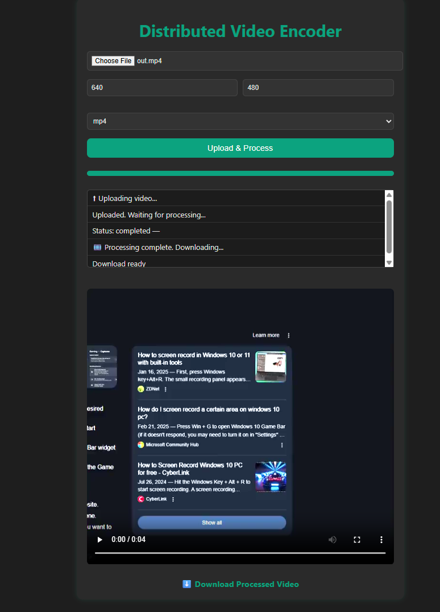

Here's the updated `README.md` including:

* Instructions for setting up and running both the **frontend React app** and the **Flask backend**
* Information about the gRPC master port
* A preview image of the final interface

---

````markdown
# Distributed Video Encoder

A simple distributed system that allows users to upload and process video files using gRPC-based segmentation and worker nodes. This interface is built with **React** for the frontend and **Flask** for the backend, integrating with a gRPC master-worker pipeline.

---

## 🔧 Features

- ✅ Upload video and track real-time status
- 🔄 Automatic polling for processing updates
- 🎞️ Video preview + download when complete
- 📏 Customize resolution and output format
- 📦 Modular, scalable with gRPC Master-Worker backend

---

## 🖥️ Run the Frontend

Make sure you have `npm` installed. Then:

```bash
cd frontend
npm install
npm start
````

> App will open at [http://localhost:3000](http://localhost:3000)

---

## 🧪 Run the Flask Backend

This Flask server acts as a bridge between the React frontend and the gRPC Master node.

### Step 1 – Install Requirements

```bash
pip install flask flask-cors grpcio grpcio-tools
```

### Step 2 – Edit the gRPC Master Address

In `flask_server.py`, update this line:

```python
GRPC_MASTER_ADDRESS = 'localhost:50053'  # ← Change this to match your running Master node port
```

### Step 3 – Run the Flask API Server

```bash
python flask_server.py
```

It runs by default at: [http://localhost:8000](http://localhost:8000)

---

## 🚀 Start Master Node & Worker(s)

Make sure you have compiled your `replication.proto` file:

```bash
python -m grpc_tools.protoc -I. --python_out=. --grpc_python_out=. replication.proto
```

### Start Master

```bash
python node.py --role master --port 50053
```

### Start Worker

```bash
python node.py --role worker --port 50054 --master localhost:50053
```

> Start multiple workers by changing the `--port`.

---
